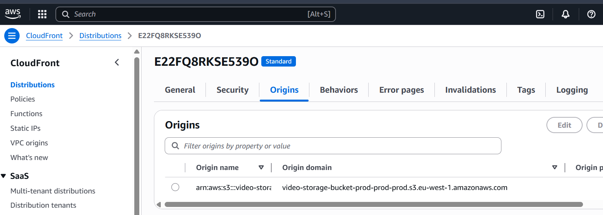

# AWS Video CDN

A production-level video hosting service built with FastAPI, AWS S3, and CloudFront CDN.

## API Endpoints

### Upload Video
`POST /api/v1/videos/upload`

Upload a video file with optional metadata.

#### Example Upload Response:

### Get Video
`GET /api/v1/videos/{video_id}`

Retrieve and stream a video by its ID.

#### Example Get Video Response:

### Get Video Info
`GET /api/v1/videos/{video_id}/info`

Get video metadata by ID.

## CloudFront CDN Integration

Our service uses AWS CloudFront as a Content Delivery Network to improve video delivery performance worldwide.

## Performance Comparison

Tests conducted between our AWS infrastructure in Ireland and a client in Australia show that using CloudFront CDN provides significantly better performance compared to direct S3 access:

### S3 Direct Access Speed:

### CloudFront CDN Speed (3x faster):

As shown in the speed tests, CloudFront provides approximately 3x better performance, making it ideal for global video content delivery.

## License

MIT
